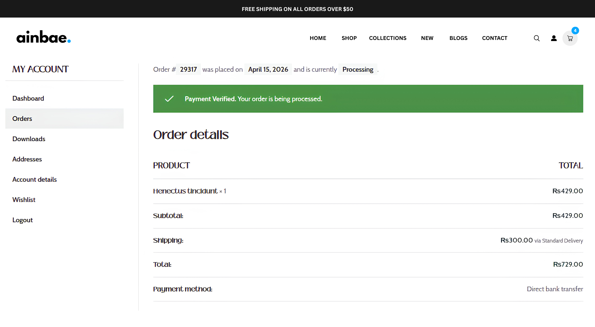
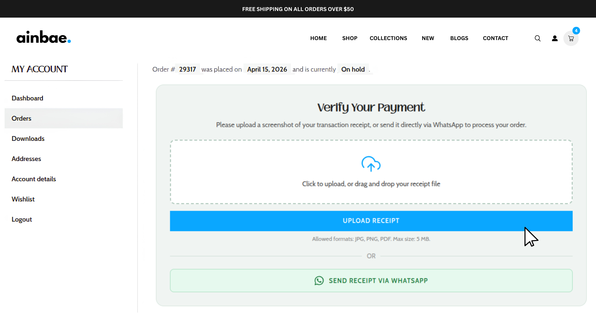
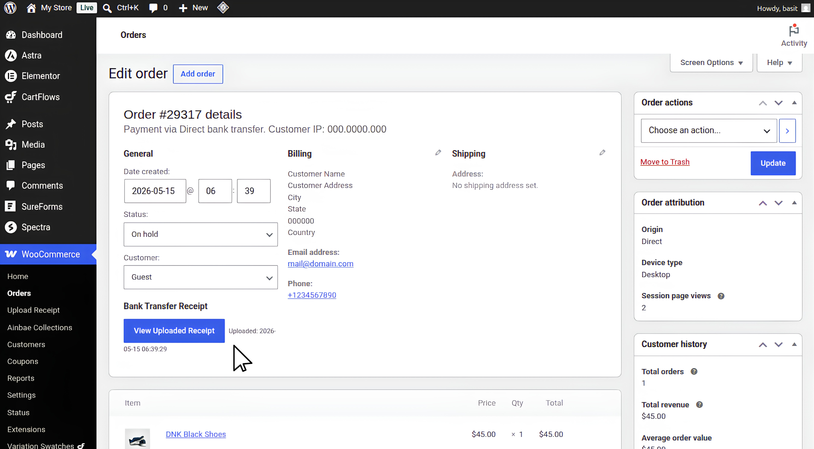

<p align="center">
  
</p>

<h1 align="center">Ainbae Receipt Upload for WooCommerce</h1>

<p align="center">
  Allow customers to upload bank transfer payment receipts directly from the WooCommerce order page, with a modern UI, secure private storage, and admin verification tools.
</p>

<p align="center">
  <a href="https://github.com/ainbaetech/Ainbae-Receipt-Upload-for-WooCommerce/releases/latest">
    
  </a>
  <a href="https://wordpress.org/plugins/ainbae-receipt-upload-for-woocommerce/">
    
  </a>
  
  
  
</p>

---

## 📋 Table of Contents

- [Features](#-features)
- [Screenshots](#️-screenshots)
- [How It Works](#-how-it-works)
- [Requirements](#-requirements)
- [Installation](#️-installation)
- [Frequently Asked Questions](#-frequently-asked-questions)
- [Translation](#-translation)
- [Developer Notes](#-developer-notes)
- [Roadmap](#-roadmap)
- [License](#-license)
- [Author](#-author)

---

## ✨ Features

- 📤 Upload receipt from the **Order Details** page and **Thank You** page
- 🧾 Supports **JPG, PNG, and PDF** formats (max 5 MB)
- 🔒 **Secure private storage** — files stored outside the public media library
- 🛡️ **Rate limiting** — max 5 upload attempts per hour per user
- 🚫 **Duplicate prevention** — one receipt per order, enforced server-side
- ⚙️ Full **admin settings dashboard** with live preview
- 🎨 **Fully customisable UI** — colours, labels, corner radius
- 📱 **WhatsApp integration** — optional deep-link button with **custom message templates** and dynamic variables
- 🛒 **Require receipt at checkout** _(new in 2.0.0)_ — BACS-only workflow: upload modal appears before the order is created (default enabled for new installs, disabled for upgrades)
- 🔍 **Reliable admin receipt detection** _(new in 2.0.0)_ — 5-priority fallback system prevents false "No receipt" messages
- 🔧 **Automatic metadata recovery** _(new in 2.0.0)_ — rebuilds broken receipt meta if the file still exists on disk
- 👨‍💼 **Admin order panel** — view receipts securely with one click
- 🌍 **Translation ready** — i18n support with `.pot` file included
- ✅ **HPOS compatible** — WooCommerce High-Performance Order Storage supported

---

## 🖼️ Screenshots

### 1. Admin Settings - Dashboard


Customise the receipt upload widget appearance and functionality.

### 2. Admin Settings - Customisation


Customize the widget colours and layout to match your store branding and check live preview.

---

### 3. Admin Setting - WhatsApp Message Template


Customize the WhatsApp message template with dynamic variables for a personalized customer experience.

---

### 4. Admin Setting - Checkout Behaviour settings


Require Receipt Before Order Placement toggle. If enabled, customers who select Direct Bank Transfer (BACS) must upload their receipt before the order is created. An upload modal appears when they click "Place Order". This setting is disabled by default.

---

### 5. Frontend - Checkout Page


The receipt upload modal appears during checkout if "Require Receipt Before Order Placement" is enabled in settings. Customers can drag-and-drop or select their receipt file, and a progress indicator shows the upload status.

---

### 6. Frontend — Thank You Page


After placing an order, customers can upload their receipt directly from the Thank You page. The upload widget is accessible only when Receipt upload is disabled at checkout, and the order is being processed via Bank Transfer (BACS).


---

### 7. Frontend — Order Details Page


Customers can also upload their receipt from the order details page if they don't upload it on the Thank You page. The upload widget is displayed only for pending Bank Transfer (BACS) orders.

---

### 8. After Upload — Confirmation Notice



A confirmation message is displayed after a successful upload, reassuring customers that their payment verification is in progress.

---

### 9. Payment Verified — Processing Status



When the admin changes the order status to Processing, customers see a confirmation that their payment has been verified.

---


### 10. Admin Order Panel — View Receipt



Admins can view uploaded receipts securely from the WooCommerce order admin panel using the View Uploaded Receipt button, which opens the file in a new authenticated tab.

---

## 💼 How It Works

### Standard Workflow (default)

1. Customer places an order and selects **Bank Transfer (BACS)** as the payment method.
2. The receipt upload widget appears on both the **Thank You page** and the **Order Details page** or on **Checkout Page** if the Require Receipt Before Order Placement setting is enabled.
3. Customer uploads a **JPG, PNG, or PDF (max 5 MB)**. The file is stored **privately** outside the public media library, renamed to a UUID so the original filename is never exposed on disk.
4. An order note is added automatically with the upload timestamp.
5. The admin opens the order and clicks **View Uploaded Receipt** to view the file securely — the endpoint is nonce-authenticated and restricted to `manage_woocommerce` capability.
6. Optionally, a **WhatsApp button** lets customers send their receipt directly to your WhatsApp number with a pre-filled, customisable order message.

### Require Receipt at Checkout _(new in 2.0.0)_

When **Require Receipt Before Order Placement** is enabled in settings (default disabled):

1. Customer selects **Bank Transfer (BACS)** at checkout.
2. Customer clicks **Place Order**.
3. An **upload modal** appears (drag-and-drop, progress indicator, accessible).
4. Customer uploads their receipt — file is validated and uploaded via AJAX.
5. On success, the order is created and the receipt is **automatically attached**.
6. Customer lands on the Thank You page with receipt already confirmed.

---

## 📑 Requirements

| Requirement | Minimum version                          |
| ----------- | ---------------------------------------- |
| WordPress   | 6.2 or higher                            |
| WooCommerce | 7.1 or higher                            |
| PHP         | 7.4 or higher                            |
| Web server  | Apache or Nginx (see FAQ for Nginx note) |

---

## ⚙️ Installation

### Automatic installation (recommended)

1. Go to **Plugins → Add New** in your WordPress admin.
2. Search for **Ainbae Receipt Upload for WooCommerce**.
3. Click **Install Now** then **Activate**.
4. Go to **WooCommerce → Upload Receipt** to configure settings.

### Manual installation

1. [Download the latest release](https://github.com/ainbaetech/Ainbae-Receipt-Upload-for-WooCommerce/releases/latest) zip file.
2. Go to **Plugins → Add New → Upload Plugin** and upload the zip.
3. Click **Activate Plugin**.
4. Go to **WooCommerce → Upload Receipt** to configure settings.

### After activation

- Make sure **Bank Transfer (BACS)** is enabled under **WooCommerce → Settings → Payments**.
- Configure the receipt upload widget appearance and behaviour under **WooCommerce → Upload Receipt**.
- If you want checkout receipt upload, enable the **Require Receipt Before Order Placement** toggle in settings.
- If you want the WhatsApp button, enter your WhatsApp number (country code + digits only, e.g. `923001234567`) in the settings.
- Save settings. The upload widget appears automatically on order pages for any pending BACS order.

---

## ❓ Frequently Asked Questions

<details>
  <summary><b>Does this work with all payment methods?</b></summary>
  <p>No — by design. The upload widget only appears for orders paid via <strong>Bank Transfer (BACS)</strong>. It will not show for card, PayPal, or any other payment method.</p>
</details>

<details>
  <summary><b>Where are the uploaded files stored?</b></summary>
  <p>Files are stored in <code>wp-content/bacs-receipts-private/</code>, which is outside the normal media library. A deny-all <code>.htaccess</code> file blocks direct browser access on Apache servers. Files are renamed to a UUID so the original filename is never exposed on disk.</p>
</details>

<details>
  <summary><b>Does it work on Nginx?</b></summary>
  <p>The <code>.htaccess</code> file is Apache-specific and has <strong>no effect on Nginx</strong>. If your server runs Nginx, add this rule to your server block:</p>
  <pre><code>location ~* /bacs-receipts-private/ { deny all; }</code></pre>
  <p>Without this rule, uploaded files on Nginx servers may be directly accessible via URL.</p>
</details>

<details>
  <summary><b>What file types are allowed?</b></summary>
  <p>JPG, JPEG, PNG, and PDF. Maximum file size is 5 MB. These limits are enforced on both the client (HTML <code>accept</code> attribute) and the server (<code>wp_handle_upload</code> MIME validation).</p>
</details>

<details>
  <summary><b>Can a customer upload more than one receipt?</b></summary>
  <p>No. Once a receipt has been uploaded for an order, the upload form is replaced with a confirmation message and any further upload attempts are blocked server-side.</p>
</details>

<details>
  <summary><b>Can customers delete their uploaded receipt?</b></summary>
  <p>No. Only an admin with the <code>manage_woocommerce</code> capability can manage uploaded files.</p>
</details>

<details>
  <summary><b>How does the admin view the receipt?</b></summary>
  <p>Open any WooCommerce order that has a receipt. A <strong>View Uploaded Receipt</strong> button appears in the order data panel. Clicking it opens the file in a new tab via a nonce-authenticated, admin-only endpoint.</p>
</details>

<details>
  <summary><b>Can I customise the WhatsApp message?</b></summary>
  <p>Yes (new in 2.0.0). Go to <strong>WooCommerce → Upload Receipt</strong> and find the <strong>WhatsApp Message Template</strong> textarea. Use these dynamic variables: <code>{order_number}</code>, <code>{order_total}</code>, <code>{customer_name}</code>, <code>{billing_email}</code>, <code>{billing_phone}</code>, <code>{site_name}</code>, <code>{currency}</code>, <code>{order_date}</code>. Leave blank to use the built-in default message.</p>
</details>

<details>
  <summary><b>What is "Require Receipt Before Order Placement"?</b></summary>
  <p>New in 2.0.0. When enabled, customers who select Direct Bank Transfer (BACS) must upload their receipt before the order is created. An upload modal appears when they click "Place Order". This setting is enabled by default for new installations (disabled for upgrades) and only affects BACS orders. If you prefer to let customers upload their receipt post-order on the Thank You page or Order Details page, you should turn this setting off.</p>
</details>

<details>
  <summary><b>Is the WhatsApp button required?</b></summary>
  <p>No. You can disable it entirely from the settings page under <strong>WooCommerce → Upload Receipt</strong>.</p>
</details>

<details>
  <summary><b>What happens if a customer tries to upload a receipt for someone else's order?</b></summary>
  <p>The plugin checks that the logged-in user's ID matches the order's customer ID. For guest orders, it validates the order key from the URL. If neither matches, the upload is rejected with a permission error.</p>
</details>

<details>
  <summary><b>Is this plugin GDPR-friendly?</b></summary>
  <p>Uploaded receipts are stored on your own server and are not transmitted to any third party by this plugin. You are responsible for including receipt data handling in your store's privacy policy. On plugin uninstall, you should manually remove <code>wp-content/bacs-receipts-private/</code> if you wish to purge all uploaded data.</p>
</details>

<details>
  <summary><b>I activated the plugin but the upload form is not showing. What should I check?</b></summary>
  <ol>
    <li>Make sure the order payment method is <strong>Bank Transfer (BACS)</strong>.</li>
    <li>Make sure the order status is <strong>Pending Payment</strong> or <strong>On Hold</strong> — the form does not appear for completed, cancelled, processing, or refunded orders.</li>
    <li>Make sure the customer is viewing their own order (logged in, or using a valid order-key link).</li>
    <li>Check that WooCommerce is active and up to date (7.1 or higher).</li>
  </ol>
</details>

---

## 🌍 Translation

This plugin is fully translation ready. All strings are wrapped in i18n functions with the text domain `ainbae-receipt-upload-for-woocommerce`.

**Included language files:**

```
languages/
└── ainbae-receipt-upload-for-woocommerce.pot   ← translation template
```

**To create a translation:**

1. Open the `.pot` file in [Poedit](https://poedit.net)
2. Choose your language
3. Translate each string
4. Save — Poedit generates both `.po` and `.mo` files automatically
5. Place both files in the `/languages/` folder

**To regenerate the `.pot` file after code changes:**

```bash
wp i18n make-pot . languages/ainbae-receipt-upload-for-woocommerce.pot --allow-root
```

Community translations are also accepted via [translate.wordpress.org](https://translate.wordpress.org/projects/wp-plugins/ainbae-receipt-upload-for-woocommerce/).

---

## 🧑‍💻 Developer Notes

- Follows [WordPress Coding Standards](https://developer.wordpress.org/coding-standards/)
- All output escaped with `esc_html()`, `esc_attr()`, `esc_url()` — no raw echoes
- All input sanitized with `sanitize_text_field()`, `absint()`, `sanitize_hex_color()` etc.
- Nonce verification on every form submission and admin endpoint
- Capability checks (`manage_woocommerce`) on all admin actions
- File uploads handled via `wp_handle_upload()` with MIME validation
- Private storage directory with `.htaccess` deny-all and `index.php` guard
- UUID-based filenames — original filenames never stored on disk
- Rate limiting via WordPress transients (5 attempts / hour / user)
- Path traversal protection via `realpath()` comparison
- WooCommerce HPOS compatible via `FeaturesUtil::declare_compatibility()`
- Hook-based integration — no core file modifications

---

## 📝 Changelog

### 2.1.0
- **New** Added a completely redesigned admin dashboard interface.
- **New** Introduced a tabbed settings layout for easier navigation.
- **New**: Added dedicated tabs for:
    - **General Settings** (WhatsApp, Require Receipt Before Order Placement Option)
    - **Text & Labels** (customize all user-facing text)
    - **Colour Settings** (customize colours for each element of the upload widget)
    - **Layout Settings** (customize the border radius of the upload widget)
- **New**: Added a modern settings header with branding and welcome section.
- **New**: Added sticky "Save Changes" footer for quicker configuration management.
- **New**: Added improved settings sections with clearer grouping and descriptions.
- **New**: Added a warning banner if Direct Bank Transfer (BACS) is not enabled in WooCommerce settings.
- **Fix**: Default whatsapp message template now correctly spaced.
- **Improvement**: Improved dashboard usability and navigation.
- **Improvement**: Improved settings organization by separating options into dedicated sections.

---

### 2.0.0

- **New**: Redesigned settings dashboard with a clean tabbed layout, modern styling, and real-time live preview
- **New**: Custom WhatsApp message template with 8 dynamic variables (`{order_number}`, `{order_total}`, `{customer_name}`, `{billing_email}`, `{billing_phone}`, `{site_name}`, `{currency}`, `{order_date}`)
- **New**: "Require Receipt Before Order Placement" — BACS-only checkout modal (enabled by default for new installations, disabled for upgrades)
- **New**: Checkout upload modal with drag-and-drop, progress bar, error handling, and full accessibility support
- **Fix**: Admin receipt detection now uses a 5-priority fallback system — eliminates false "No receipt uploaded yet" messages
- **New**: Automatic metadata recovery — rebuilds broken receipt meta when the physical file still exists on disk
- **New**: Centralized `AINBAE_BACS_VERSION` constant (`2.0.0`) used for all `wp_enqueue_*` calls
- **New**: Debug logging for upload failures, recovery events, missing metadata, and invalid references (gated behind `WP_DEBUG_LOG`)
- **Compatibility**: All existing settings, uploads, orders, and workflows remain unchanged

---

### 1.2.0

- Fixed Setting Page WhatsApp number field prefix input styling
- Added languages directory and translation files
- Updated tested up to version to 10.8.1 (WooCommerce)
- Updated stable tag to 1.2.0 for latest release

---

### 1.0.3

- Updated tested up to version to 7.0
- Updated stable tag to 1.0.3 for latest release

---

### 1.0.2

- Moved private receipt storage from wp-content root into `wp-content/uploads/ainbae-receipt-upload-for-woocommerce/` using `wp_upload_dir()` per WordPress guidelines
- Replaced `WP_CONTENT_DIR` constant with `wp_upload_dir()` for correct path resolution across all WordPress configurations
- Replaced echo of binary file contents with `readfile()` to stream files without buffering or escaping concerns
- Removed broken donate link from readme.txt
- Updated readme FAQ to reflect new storage path and Nginx configuration instructions

---

### 1.0.1

- Security: replaced `file_put_contents()` with WP Filesystem API
- Security: added explicit `is_uploaded_file()` check before `wp_handle_upload()`
- Security: added `Content-Security-Policy` header when serving receipt files
- Fix: asset version strings now use plugin version constant instead of hardcoded value
- Fix: corrected `WC tested up to` version to reflect currently released WooCommerce
- Improvement: added `Requires PHP` and `WC requires at least` headers
- Improvement: uninstall routine now removes uploaded receipt files and order post-meta
- Improvement: added Settings link to plugin row on the Plugins screen

---

### 1.0.0

- Initial release

---

## 🚀 Roadmap

Features planned for future releases:

- [ ] Email notification to admin on receipt upload
- [ ] Admin approve / reject system with customer notification
- [ ] Automatic order status change after receipt upload
- [ ] Multiple file uploads per order
- [ ] Cloud storage support (Amazon S3, Google Drive)
- [ ] WhatsApp Business API automation
- [ ] Receipt expiry and re-upload window

---

## 📄 License

Licensed under the [GNU General Public License v2.0 or later](https://www.gnu.org/licenses/gpl-2.0.html).

---

## 👨‍💻 Author

**Ainbae**
🌐 [https://www.ainbae.com](https://www.ainbae.com)

---

## ⭐ Support

If this plugin helps your store, please consider:

- Giving it a ⭐ on [GitHub](https://github.com/ainbaetech/Ainbae-Receipt-Upload-for-WooCommerce)
- Leaving a review on [WordPress.org](https://wordpress.org/plugins/ainbae-receipt-upload-for-woocommerce/)
- Reporting bugs via [GitHub Issues](https://github.com/ainbaetech/Ainbae-Receipt-Upload-for-WooCommerce/issues)
