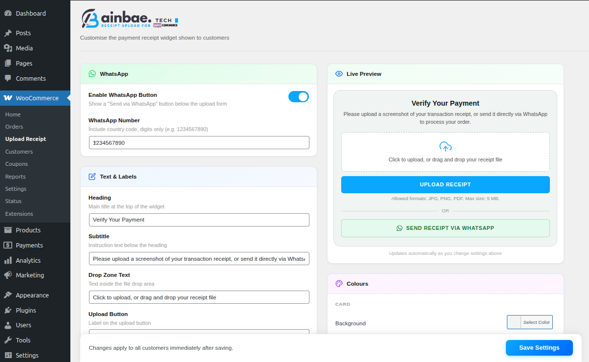
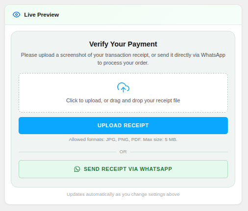
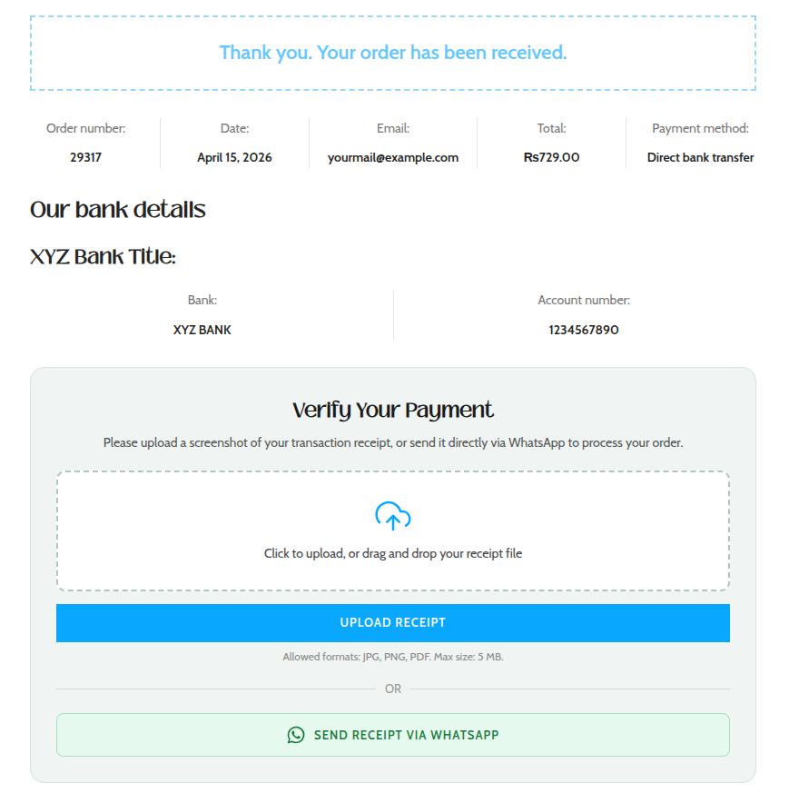
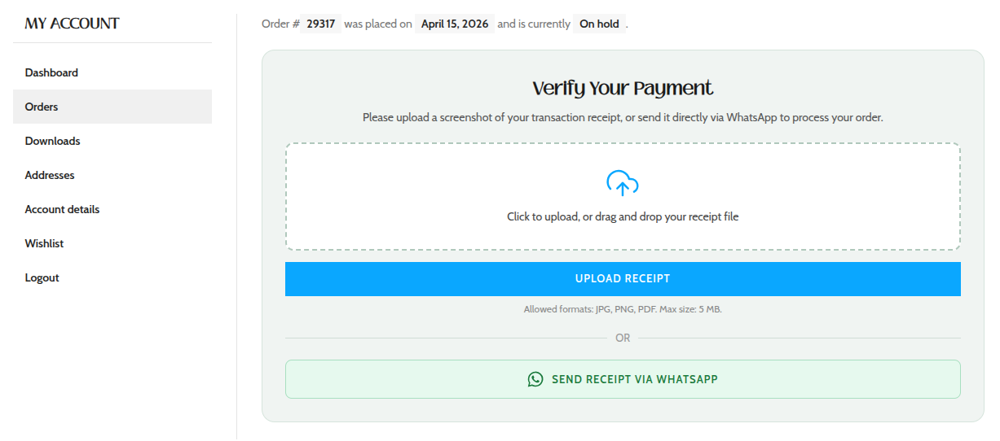
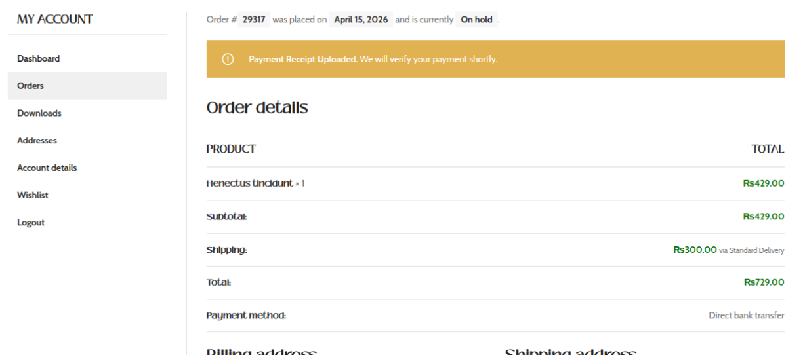
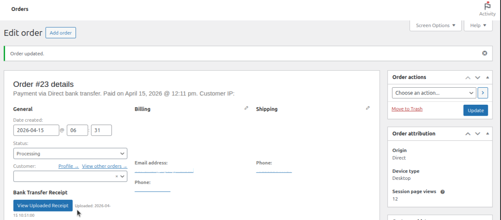

<p align="center" style="margin-bottom: 20px; background: #f9f9f9; padding: 5px;">
  
</p>

<h1 align="center">Ainbae Receipt Upload for WooCommerce</h1>

<p align="center">Allow customers to upload bank transfer payment receipts directly from the WooCommerce order page — with a modern UI, secure storage, and admin verification tools.
</p>

---

<p align="center" style="margin-top: 20px;">
  <a href="https://github.com/ainbaetech/Ainbae-Receipt-Upload-for-WooCommerce/releases/latest">
    
  </a>
  <!-- <a href="https://wordpress.org/plugins/ainbae-receipt-upload-for-woocommerce">
    
  </a> -->
</p>

## ✨ Features

- 📤 Upload receipt from **Order Details page**
- 🧾 Supports **JPG, PNG, PDF**
- 🔒 Secure private file storage (protected directory)
- ⚙️ Full **admin settings dashboard**
- 🎨 Customizable UI (colors, labels, layout)
- 📱 WhatsApp integration for manual sharing
- 🚫 Rate limiting for security
- 👨‍💼 Admin panel to view uploaded receipts
- 🌍 Translation-ready (i18n support)

---

## 🖼️ Screenshots

### 🔧 Admin Settings Dashboard



---

### 👁️ Live Preview Panel



---

### 💳 Frontend – Thank You Page



---

### 📂 Order Details – Upload Section



---

### 📩 After Upload Notice



---

### ✅ Payment Verified Status


---

### 🛠️ Admin Order Panel



---

## ⚙️ Installation

1. Upload the plugin folder to:
   ```
   /wp-content/plugins/
   ```
2. Activate the plugin through the **Plugins** menu in WordPress
3. Go to:
   ```
   WooCommerce > Receipt Upload
   ```
4. Configure settings as needed

---

## 🔐 Security Features

- Nonce verification for uploads
- File type validation (MIME + extension)
- Private directory with `.htaccess` protection
- Rate limiting to prevent abuse
- Permission checks for order access

---

## 🧠 Use Cases

Perfect for stores using:

- Bank Transfer (BACS)
- Manual payments
- Cash deposits
- WhatsApp-based order confirmations

---

## 🌍 Translation

This plugin is fully translation-ready.

Language files:

- `ainbae-receipt-upload.pot` (template)

You can generate `.po` / `.mo` files for any language.

---

## 🧑‍💻 Developer Notes

- Built following WordPress coding standards
- Uses `esc_*` functions for safe output
- Modular structure for easy extension
- WooCommerce hooks-based integration

---

## 💼 Roadmap (Pro Version Ideas)

- Email notification on receipt upload
- Admin approve/reject system
- Auto order status change
- Multiple file uploads
- Cloud storage (S3 / Drive)
- WhatsApp API automation

---

## 📄 License

Licensed under GPL v2 or later.

---

## 👨‍💻 Author

**Ainbae**  
🌐 https://www.ainbae.com

---

## ⭐ Support

If you like this plugin, consider giving it a ⭐ on GitHub!
